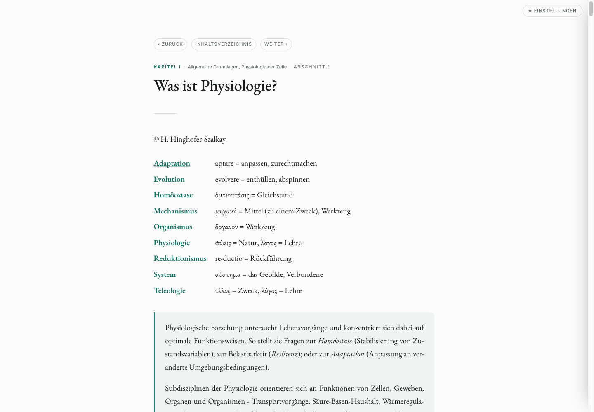
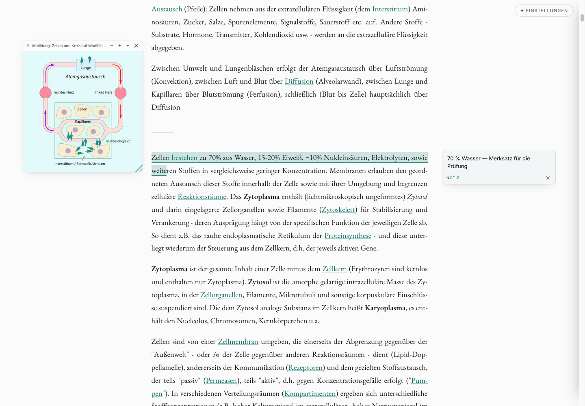
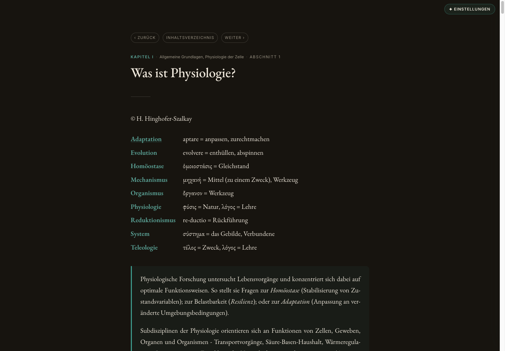

<p align="center">
  
</p>

<h1 align="center">Klartext Physiologie</h1>

<p align="center">
  A Chrome extension that turns <a href="http://physiologie.cc/">physiologie.cc</a> into a calm,
  readable textbook — and gives you somewhere to take notes.<br>
  Everything stays on your machine.
</p>

<p align="center">
  
</p>

---

## What this is

*Reise durch die Physiologie* by H. Hinghofer-Szalkay is an excellent, freely readable physiology
textbook wrapped in 1990s hand-authored HTML: full-window line lengths, aqua backgrounds, inline
`<font>` colours, and hundreds of decorative arrows and pointing fingers between you and the text.

This extension rebuilds each page as a reading surface — one narrow column, a real heading
hierarchy, figures at their own resolution — and adds the tools you actually want while studying:
highlighting, margin notes, and pinned figures. It touches nothing but `physiologie.cc`, makes **no
network requests of its own**, and stores every setting and annotation locally.

**The design in one line:** warm paper and near-black ink, a serif carrying the prose against a
small tracked sans for labels and captions, a single restrained accent used only as line and tint —
never as a fill — a ~680 px measure so lines land at 65–75 characters, generous vertical rhythm, and
motion that stays quiet.

## Install (unpacked)

1. Open **`chrome://extensions`** and switch on **Developer mode** (top right).
2. **Load unpacked** → select this folder.
3. Open any page on **http://physiologie.cc/** — the reader draws itself in.
4. **✦ Einstellungen** (top right of the page) tunes type, width, colour and background. The toolbar
   icon is the global **on/off** switch.

## What you get

### Reading

- **You always know where you are.** Nothing in the original page states its place in the book, so
  the extension derives it from the URL and prints it above the title —
  *Kapitel I · Allgemeine Grundlagen, Physiologie der Zelle · Abschnitt 1* — with the chapter linking
  back to its hub. Index entries on hub pages get numbered the same way.
- **A real type hierarchy**, ranked from the *original* computed font sizes rather than guessed:
  titles, sections, run-in subheads, body.
- **The page opens as a list of its own contents.** A section page is otherwise one wall of text —
  I.1 alone is 880 blocks under 47 headings. The author names his sections once, at the top, as a
  row of links separated by a small glyph; the extension reads that row back out and folds the page
  into those sections, all collapsed. Click one to read it; what you leave open is remembered.
  Ctrl+F still finds text inside a folded section and opens it for you.
- **Figures at their own resolution**, wrapped with their caption and click-to-zoom. The decorative
  layer — repeated arrows, pointing fingers, spacer gifs, coloured dots — is hidden; navigation
  button-images become plain text links.
- **The yellow boxes survive as callouts.** The source paints them for emphasis (often exam-relevant
  IMPP notes); they become accent cards instead of casualties.
- **Data tables are rebuilt**; layout tables are dissolved. Glossary and definition runs become real
  definition lists.
- **Read-tracking.** Every page you open is recorded locally, and links pointing to pages you have
  already read are marked — worth a lot in a book of 200+ near-identical index entries.
- **A reading rail** down the right edge: one hairline tick per unit of the page, grouped by
  section. The ticks behind you fade as you read, so the page quietly shows how far you have got —
  on the rail and as a small meter under each collapsed section title. Hover it for the section
  names, the percentage and a reset; click a tick to travel there.
- **Bookmarks.** The rail keeps one automatic mark at the spot you last left off, so skimming ahead
  never loses it, and **⌑ Lesezeichen** drops as many of your own as you like. Click a mark to jump
  back, hover it for the ✕ — with an undo toast, like everything else here.
- The image-only landing page gets its own hero; in-page anchors (`#Z_Golgiapparat` and friends)
  keep resolving.

### Studying

<p align="center">
  
</p>

- **Highlighting** — select text and pick teal, amber, rose or underline. **Right-click** an existing
  highlight to recolour it, attach a note, or remove it.
- **Margin notes** — anchored in the right gutter, level with their highlight. **Enter** finishes,
  **Shift+Enter** adds a line break, and hovering a note lights up the text it belongs to.
- **Figures** — click to open the lightbox: zoom with the scroll wheel, the − / + buttons or a
  double-click, drag to pan, click the percentage to reset. **„An den Rand heften"** turns a figure
  into a free-floating card you can drag anywhere and resize from the corner, so fine labels stay
  readable while you scroll on. Position, size and collapsed state persist per page.
- **Undo** — removing a highlight or note, or unpinning a figure, raises a toast with **Rückgängig**.
- **Turn-on animation** — the page is drawn in top→bottom behind a sweeping accent line. It plays
  **once per browser session**; there is no replay control, and it respects both the motion setting
  and `prefers-reduced-motion`.

Annotations survive reloads: they are re-anchored by content hash plus a W3C-style text quote, so
they hold even if the surrounding page shifts (`src/anchor.js`).

## Einstellungen

| Group | Controls |
|---|---|
| **Schrift** | Lesefont — **EB Garamond** (default) · Computer Modern · Source Serif 4 · Newsreader · Inter · Source Sans 3 · IBM Plex Sans<br>Label-/Bildtextfont — **Inter** · Space Mono · IBM Plex Mono · CMU Typewriter<br>Notizfont — **Inter** · IBM Plex Sans · Source Sans 3 · EB Garamond · Space Mono<br>Schriftgröße (19 px) · Zeilenhöhe (1.68) |
| **Layout** | Textbreite (680 px) · Absatzabstand · Textsatz — linksbündig / **Blocksatz** |
| **Farbe** | Akzentfarbe — **Physio-Türkis `#0e8373`** + Blau · Violett · Terrakotta · Moos + free picker<br>Hintergrund — **Neutral** · Papier · Weiß · Sepia · Dunkel |
| **Bilder** | Dekobilder ausblenden (on) · Abbildungsrahmen — **Haarlinie** / Schatten / ohne |
| **Lesen** | Abschnitte einklappen (on) · Fortschrittsleiste (on) · Gelesenes markieren (on) · *• Gelesenes vergessen* |
| **Bewegung** | Animationen (on) |
|  | *↺ Zurücksetzen* |

<p align="center">
  
</p>

## How it works

The site encodes its structure visually only — no `<h1>`–`<h6>` anywhere, layout by `<br>` and
`<center>`, thousands of `<font>` tags. So the extension does not restyle it in place: it
**extracts and re-renders**. `src/reskin.js` linearises the page into a token stream, assembles a
semantic block model, and emits clean HTML into a fresh `<main id="pr-reader">`.

Two ordering rules hold the whole thing together: `boot.css`/`boot.js` run at `document_start` to
kill the flash of the original page (the body is hidden but still laid out, so measuring stays
truthful), and the `document_end` chain then follows a fixed sequence — **measure the original font
sizes → build the reader → apply settings → switch the reskin on (`html.pr-on`) → fold it into
sections (after the annotations are back, never before) → reveal (`html.pr-ready`)**.

```
manifest.json          MV3; matches http://(www.)physiologie.cc/*
popup.html             toolbar on/off switch
src/
  boot.css · boot.js   document_start: no flash of the original page
  store.js             chrome.storage.local wrapper (settings global · one record per page)
  visited.js           records pages read; tags links to them
  anchor.js            self-healing annotation anchoring (content hash + text quote)
  fonts.js             @font-face for the bundled woff2
  reskin.js            extract & re-render: block model → clean HTML, crumb, figures, tables
  ui.js · ui.css       all injected chrome, in one Shadow DOM
  tools.js             lightbox · pins · highlights · notes · toasts
  outline.js           the page's sections, read off the author's strip; the accordion
  progress.js          the reading rail: read-state per section · bookmarks · reset
  settings.js          the ✦ Einstellungen panel; writes CSS vars on :root
  activate.js          the once-per-session turn-on animation
  content.js           document_end orchestrator
  content.css          the reader stylesheet (inert until html.pr-on)
  popup.js             the toolbar switch
fonts/                 bundled woff2 + LICENSES.md
icons/                 16 / 32 / 48 / 128
```

`CLAUDE.md` is the architecture document — read it before changing the rendering pipeline.

## Development

There are no automated tests; the extension is exercised against real page HTML with a local
harness. In short: serve the repo (`python3 -m http.server 8756`), drop latin-1 page snapshots in
`.test/`, and build a harness page with `python3 dev/mkharness.py .test/<page> dev/harness_<x>.html`
— it inlines the body and loads the real `src/*` chain with stubs for `chrome.storage.local` and
`chrome.runtime.getURL`. `CLAUDE.md` has the full recipe, the representative page spread, and the
harness caveats.

## Privacy

Nothing leaves your device — no analytics, no network requests, no data sent anywhere. See
[`PRIVACY.md`](PRIVACY.md).

## Repo layout

```
src/ · manifest.json · popup.html · fonts/ · icons/   the extension (source of truth)
CLAUDE.md            architecture + working notes
PRIVACY.md           privacy policy
research/            before-* : the original site · after-* : the extension
dev/mkharness.py     test-harness generator
prototype.html       the pre-extension design prototype — historical, kept for reference
serve.command        double-click (macOS) to serve the folder and open that prototype
```

## Credits

The book — text and figures — is © H. Hinghofer-Szalkay, published at
[physiologie.cc](http://physiologie.cc/). This extension only changes how it looks in your browser;
it neither copies nor redistributes the content. Licences for the bundled typefaces are in
[`fonts/LICENSES.md`](fonts/LICENSES.md).
